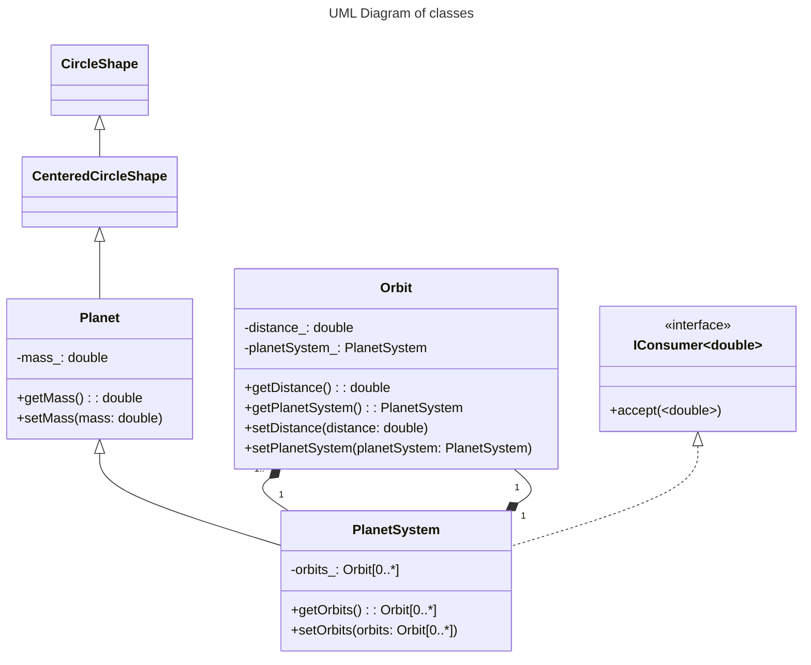

# Sun System

```mermaid
---
title: UML Diagram of classes
---
classDiagram
    CircleShape <|-- CenteredCircleShape
    CenteredCircleShape <|-- Planet
    Planet <|-- PlanetSystem
    Orbit "1..*" *-- "1" PlanetSystem
    Orbit "1" --* "1" PlanetSystem
    IConsumer~double~ <|.. PlanetSystem
    
    class IConsumer~T~ {
        <<interface>>
        +accept(~double~)
    }
    class Planet {
        -mass_: double
        +getMass(): double
        +setMass(mass: double)
    }
    class Orbit {
        -distance_: double
        -planetSystem_: PlanetSystem
        +getDistance(): double
        +getPlanetSystem(): PlanetSystem
        +setDistance(distance: double)
        +setPlanetSystem(planetSystem: PlanetSystem)
    }
    class PlanetSystem {
        -orbits_: Orbit[0..*]
        +getOrbits(): Orbit[0..*]
        +setOrbits(orbits: Orbit[0..*])
    }
```